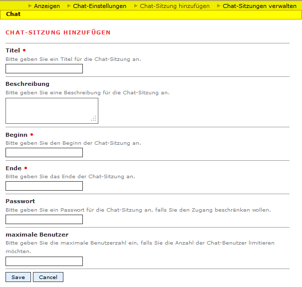

Chatsitzung
=============

Eine Chatsitzung ermöglicht es den Besuchern den Austausch zu einem Thema. Eine Chatsitzung wird grundsätzlich von einem Moderator eingerichtet.

Es existieren **drei Zustände**, in dem sich eine Chatsitzung abhängig von seiner zeitlichen Konfiguration befinden kann:

* *geplant*
    Der Sitzungsanfang liegt noch in der Zukunft.

* *aktiv*
    Der Sitzung hat angefangen und das Sitzungsende ist noch nicht erreicht.

* *abgelaufen*
    Das Sitzungsende liegt in der Vergangenheit.

Auf der Startseite werden die aktiven Chatsitzungen präsentiert. Falls keine aktiven Chatsitzungen existieren, werden ggf. geplante Chatsitzungen gezeigt.

.. _einrichten-chatsession:

Einrichten
-------------

Um eine neue Chatsitzung einzurichten, gehen Sie über die gelbe Leiste auf *Chat-Sitzung hinzufügen*. Sie werden folgendes Formular sehen:

Folgende Einstellungen lassen sich vornehmen:

Titel
^^^^^

Der Titel soll bündig das Thema der Chatsitzung beschreiben. Der Titel wird für den Besucher auf der Startseite gezeigt.

Beschreibung
^^^^^^^^^^^^

Mit der Beschreibung wird das Thema ausführlich beschrieben. Der Beschreibungstext wird oberhalb des Chatfensters angezeigt.

Beginn und Ende
^^^^^^^^^^^^^^^
Mit Beginn und Ende wird der Zeitraum definiert, in der die Chatsitzung aktiv ist.

Passwort
^^^^^^^^
Falls Sie den Zugang der Chatsitzung mit einem Passwort beschränken wollen, können Sie dies hier eingeben.

.. note::

    Wenn Sie kein Passwort hinterlegen möchten, lassen Sie bitte das Feld frei.

maximale Benutzer
^^^^^^^^^^^^^^^^^
Falls für die Chatsitzung eine maximale Teilnehmeranzahl vorgesehen ist, können Sie hier diese Anzahl angeben.

.. note::

    Falls Sie keine Limitierung planen, lassen Sie bitte das Feld frei.

Verwalten
-------------

Sie können bereits existierende Chatsitzungen verwalten, indem Sie über die gelbe Leiste auf *Chat-Sitzung verwalten* gehen.
Dort haben Sie die Möglichkeit Chatsitzungen zu **bearbeiten** oder zu **löschen**.

Sie sollten folgende Übersicht sehen:

Bearbeiten
^^^^^^^^^^

Zum Bearbeiten einer Chatsitzung klicken Sie zunächst auf den gleichnamigen Link in der Zeile der jeweiligen Chatsitzung.
Sie können nun analog zum :ref:`einrichten-chatsession`-Schritt ein Formular ausfüllen und diese Chatsitzung bearbeiten.

Löschen
^^^^^^^^^^

Zum Löschen einer oder mehrerer Chatsitzungen bleiben Sie bitte auf *Chat-Sitzung vewalten* und wählen durch Klick der Checkboxen in der rechten Spalte die Chatsitzungen, die Sie löschen wollen.
Bestätigen Sie ihre Eingabe, indem Sie auf *Löschen* klicken.

Protokoll ausgeben
------------------
Sie können das Protokoll von Chatsitzungen ausgeben lassen, indem Sie auf *Log* in der Zeile der jeweiligen Chatsitzung klicken.
Das Protokoll beinhaltet in welcher Konfiguration die Chatsitzung ablief und die Nachrichten der einzelnen Teilnehmer.
Moderatoren werden hierfür gesondert markiert.
Es ist außerdem zu beachten, dass ursprüngliche Texte wie auch gelöschte Nachrichten, nicht angezeigt werden.