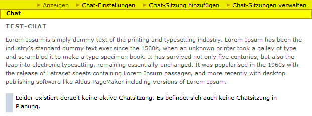
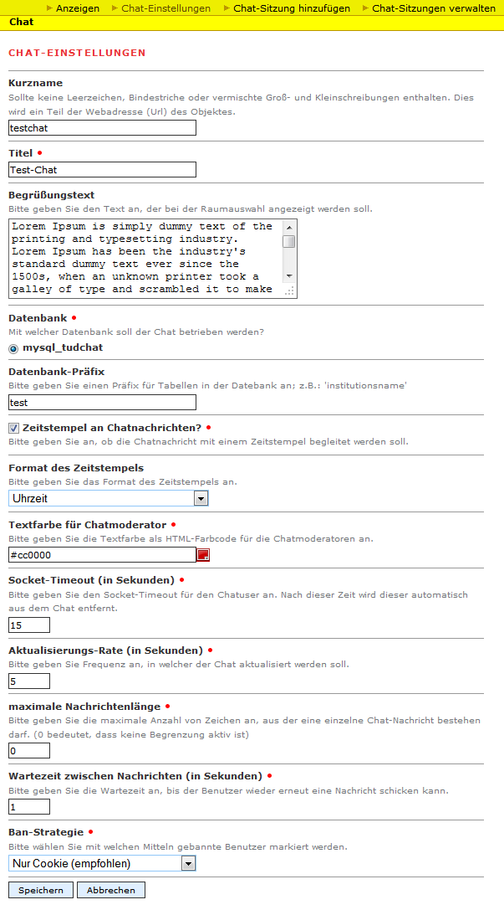
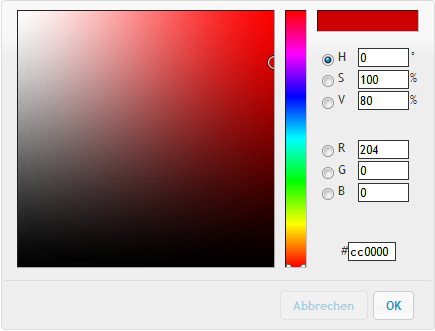

Erste Schritte
===============

Chat beantragen
---------------

Um einen Chat für ihre Zwecke auf der Webseite der TU Dresden nutzen zu können, wenden Sie sich dazu bitte an die `Nutzerberatung des Medienzentrum <http://tu-dresden.de/die_tu_dresden/zentrale_einrichtungen/mz/dienstleistungen/nutzerberatung>`_.

Bitte teilen Sie uns folgende Informationen mit:

1. in welchem Bereich der Chat erscheinen soll **und**
2. welche Personen mit Ihren E-Mail-Adressen als Moderator zugelassen werden sollen.

Nachdem wir Ihren Anfrage bearbeitet haben, können Sie den Chat selbstständig konfigurieren und Chatsitzungen einrichten.

Falls Sie Fragen zu weiteren Angelegenheiten haben, dann wenden Sie sich bitte an die Nutzerberatung.

Chat einrichten
---------------

Der Chat wird initial vom Medienzentrum eingerichtet. Ihnen ist es aber dennoch möglich die grundlegenden Chateinstellungen nach ihren Wünschen nachträglich zu ändern.
Um die Chateinstellungen zu ändern, navigieren Sie zuerst zum Bereich in dem sich der Chat befindet und klicken Sie anschließend auf den Namen ihres Chats.
Es sollte sich nun die Startseite zeigen, welche wie folgt aussehen sollte:

Wählen Sie nun in der gelben Leiste den Punkt *Chat-Einstellungen*. Es sollte sich nun folgendes Formular zeigen:

Folgende Einstellungsmöglichkeiten lassen sich ändern:

Kurzname
^^^^^^^^
Der Kurzname beschreibt den Namen, unter der der Chat gefunden wird. Konkret äußert sich dies, dass die Adresse des Chats im Browserfenster mit ``/kurzname`` enden wird.

Titel
^^^^^
Der Titel beschreibt den übergeordneten Titel ihres Chats. Ein Beispiel wäre ``Chat des Instituts <name>``.

Begrüßungstext
^^^^^^^^^^^^^^
Dieser Text wird auf der Startseite erscheinen und kann das Hauptanliegen ihrer Chatsitzungen erläutern.

Datenbank *(Nur Experten)*
^^^^^^^^^^^^^^^^^^^^^^^^^^
Wählen Sie hier die Datenbank, aus mit welcher der Chat betrieben werden soll. Falls Sie ihren Chat aus bestimmten (z. B. datenschutzrechtlichen oder verwaltungstechnischen) Gründen mit einer eigenen Datenbank betreiben wollen, so kontaktieren Sie bitte die Nutzerberatung des Medienzentrums.

Datenbank-Präfix *(Nur Experten)*
^^^^^^^^^^^^^^^^^^^^^^^^^^^^^^^^^
Da sich mehrere Chats sich eine Datenbank teilen können, müssen Sie einen einzigartigen Präfix für die Tabellen festlegen. Im Allgemeinen müssen Sie diesen Wert allerdings **nicht** ändern.

.. _zeitstempel-firststeps:

Zeitstempel an Chatnachrichten?
^^^^^^^^^^^^^^^^^^^^^^^^^^^^^^^
Machen Sie ein Häkchen, wenn Sie die Chatnachrichten mit einem Zeitstempel begleitet werden soll.

Format des Zeitstempels
^^^^^^^^^^^^^^^^^^^^^^^
Sofern Sie bei :ref:`zeitstempel-firststeps` die Zeitstempel aktiviert haben, sollten Sie ein geeignetes Format zur Anzeige dazu einstellen.
Es stehen folgende Optionen zur Verfügung:

* Uhrzeit, z. B. ``12:00:00``
* Uhrzeit (ohne Sekunden), z. B. ``12:00``
* Datum und Uhrzeit, z. B. ``1.1.2014, 12:00:00``
* Datum und Uhrzeit (ohne Sekunden), z. B. ``1.1.2014, 12:00:00``

Textfarbe für Chatmoderator
^^^^^^^^^^^^^^^^^^^^^^^^^^^
Wählen Sie hier eine Textfarbe, aus mit der Chatmoderatoren gekennzeichnet werden.
Sie können die Farbe als HTML-Farbcode angeben oder über den ColorPicker (erreichbar durch Klick auf |colorpicker_symbol|) bequem auswählen:

Socket-Timeout (in Sekunden)
^^^^^^^^^^^^^^^^^^^^^^^^^^^^
Der Socket-Timeout beschreibt die Zeit, nach welcher der Benutzer automatisch aus dem Chat entfernt wird, sofern er nicht reagiert.
Dies trifft beispielsweise zu, wenn der Benutzer sein Browserfenster für eine gewisse Zeit geschlossen hat.

Aktualisierungsrate (in Sekunden)
^^^^^^^^^^^^^^^^^^^^^^^^^^^^^^^^^
Die Aktualisierungsrate beschreibt die Frequenz in der Benutzer neue Nachrichten bekommen.

Maximale Nachrichtenlänge
^^^^^^^^^^^^^^^^^^^^^^^^^
Die maximale Nachrichtenlänge beschreibt die Anzahl von Zeichen, aus der eine einzelne Chat-Nachricht bestehen darf.

.. note::

    Der Spezialwert ``0`` bedeutet, dass keine Begrenzung aktiv ist.

Wartezeit zwischen Nachrichten (in Sekunden)
^^^^^^^^^^^^^^^^^^^^^^^^^^^^^^^^^^^^^^^^^^^^
beschriebt die Wartezeit, bis der Benutzer wieder erneut eine Nachricht schicken kann.

Ban-Strategie
^^^^^^^^^^^^^
Benutzer können permanent des Chats verwiesen werden, dies ist auch bekannt unter den Begriff *Bannen*. Mittels unterschiedlicher Strategien können Benutzer als gebannt markiert werden. Es gibt allerdings nicht **die** Lösung für dieses Problem und sie können unter Umständen umgangen werden.

Es stehen folgende Strategien zur Verfügung:

* **Nur Cookie**
    Es wird ein Browser-Cookie beim Benutzer hinterlegt. Sofern der Benutzer allerdings seinen Browser so einstellt, dass er keine Cookies speichert oder gar manuell löscht, so ist diese Strategie wirkungslos.

* **Nur IP-Adresse**
    Im Chat wird sich die IP-Adresse des Benutzers gesperrt. Sollte sich ein Benutzer mit derselben IP-Adresse versuchen sich anzumelden, so wird er abgelehnt. Auch dieses Verfahren kann gebrochen werden, indem *Proxies* verwendet werden und somit nicht die tatsächliche IP-Adresse des Benutzers gesperrt wird. Es kann sich auch nachteilig erweisen, wenn sich mehrere Nutzer eine gemeinsame IP-Adresse teilen (z. B. Heimnetzwerk, Schule).

* **Cookie und IP-Adresse**
    Es werden beide eben genannten Verfahren benutzt, um den Benutzer zu sperren. Dies ist die restriktivste Variante.

Unter den vorgestellten Strategien, empfehlen wir die Variante *Nur Cookie*, weil sie für den Großteil der Benutzer eine probate Lösung darstellt.