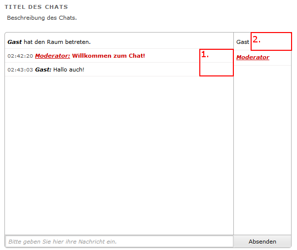
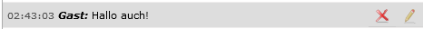
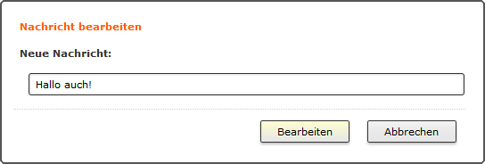
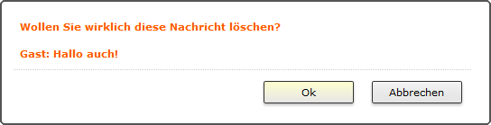
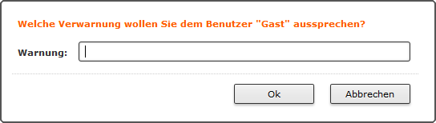
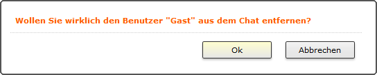
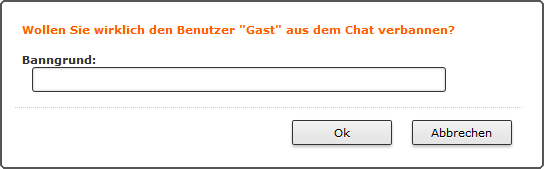

Moderation
==========

.. |message_edit| image:: _static/message_edit.png
    :alt: Nachricht bearbeiten

Während normale Benutzer im Chatfenster nur Nachrichten schreiben können, ist es Moderatoren darüber hinaus möglich Nachrichten zu bearbeiten, Nachrichten zu löschen, sowie Benutzer zu verwarnen wie auch zu verbannen.

Um solche Aktionen durchzuführen stehen dem Moderator weitere Felder zur Verfügung:

In dem mit ``1.`` gekennzeichneten Rahmen befinden sich die Elemente für die Moderation der Nachrichten, während sich bei dem mit ``2.`` gekennzeichneten Rahmen die Elemente für die Moderation der Benutzer befinden.
Durch das Fahren mit der Maus in diese Bereiche, werden diese Elemente sichtbar:

    Optionen zur Moderation einer Nachricht (Löschen und Bearbeiten)

.. figure:: _static/moderate_user.png
    :align: center
    :alt: Moderation eines Benutzers

    Optionen zur Moderation eines Benutzers (Verwarnen, Entfernen und Verbannen)

Nachrichten bearbeiten
----------------------
Durch Klick auf das *Nachricht bearbeiten*-Symbol (|message_edit|) öffnet sich ein Dialogfenster mit einem Eingabefeld für den neuen Text:

Durch Klick auf *Bearbeiten* oder der Enter-Taste bestätigen Sie ihre Eingabe.

Nachrichten löschen
-------------------
Durch Klick auf das *Nachricht löschen*-Symbol (|message_delete|) öffnet sich ein Dialogfenster zur Bestätigung dieser Aktion:

Durch Klick auf *Ok* oder der Enter-Taste bestätigen Sie ihre Eingabe.

Benutzer verwarnen
------------------

Durch Klick auf das *Benutzer verwarnen*-Symbol (|user_warn|) öffnet sich ein Dialogfenster mit einem Eingabefeld für den Verwarntext:

Durch Klick auf *Ok* oder der Enter-Taste bestätigen Sie ihre Eingabe.

Benutzer entfernen
------------------

Durch Klick auf das *Benutzer entfernen*-Symbol (|user_kick|) öffnet sich ein Dialogfenster zur Bestätigung dieser Aktion:

Durch Klick auf *Ok* oder der Enter-Taste bestätigen Sie ihre Eingabe.

Benutzer vom Chat verbannen
---------------------------

Durch Klick auf das *Benutzer verbannen*-Symbol (|user_ban|) öffnet sich ein Dialogfenster mit einem Eingabefeld für den Banngrund:

Durch Klick auf *Ok* oder der Enter-Taste bestätigen Sie ihre Eingabe.
